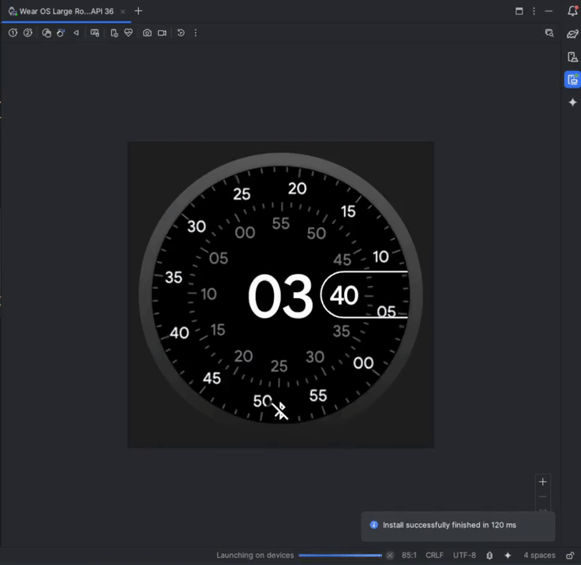

# Forex Wear OS
A simple Wear OS app built with Kotlin and Jetpack Compose that displays currency exchange from the AwesomeAPI.

Demo:



## About:
The project was developed as a practical study of modern Android architecture applied to wearables.
The main goal is to display data from a public API efficiently on a wearable device.

- Language: Kotlin
- UI: Jetpack Compose for Wear OS
- Asynchronicity: Coroutines & Flow
- Networking: Retrofit & OkHttp
- Data Parsing: Gson
- Architecture: Clean MVVM (ViewModel + Repository)
- Security: API key stored in local.properties and exposed via BuildConfig.

## Architecture
```bash
com.powluiz.forexwearos/
├── data/                      # Data layer (networking and repository)
│   ├── model/
│   │   └── ApiModels.kt       # DTOs for the API response
│   ├── api/
│   │   ├── ForexApiService.kt # Service defining API endpoints
│   │   └── RetrofitClient.kt  # OkHttp/Retrofit client setup
│   └── repository/
│       └── ForexRepository.kt # Source of truth for currency data
│
└── presentation/              # UI layer (presentation)
    ├── viewmodel/
    │   └── ForexViewModel.kt  # Manages UI state and logic
    ├── screen/
    │   └── ForexScreen.kt     # Main Composable screen
    ├── theme/
    │    └── Theme.kt
		└── MainActivity.kt         # App entry point
```

## How to run?
You will need to provide your own API key from AwesomeAPI, then add your API key to local.properties:

```bash
AWESOME_API_KEY=<YOUR_API_KEY_HERE>
```

Sync the project with Gradle, then build and run it with an emulator.